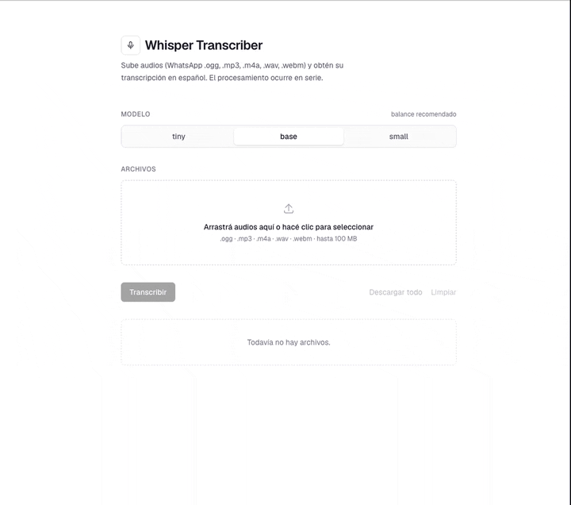

# Whisper Transcriber

Aplicación web local para transcribir audios (notas de WhatsApp, grabaciones, etc.) a texto en español, usando [whisper.cpp](https://github.com/ggerganov/whisper.cpp) vía [`nodejs-whisper`](https://www.npmjs.com/package/nodejs-whisper).

Todo el procesamiento ocurre dentro del contenedor: no se envía audio a servicios externos.



## Características

- Interfaz web (Next.js 16 + React 19) para subir múltiples archivos y descargar los `.txt` resultantes.
- Elegí entre los modelos `tiny`, `base` y `small` de Whisper según velocidad/precisión.
- Formatos aceptados: `.ogg`, `.mp3`, `.m4a`, `.wav`, `.webm` (cualquier `audio/*` soportado por ffmpeg). Tamaño máximo por archivo: 100 MB.
- Idioma fijado en español (`es`).
- Corre 100% en CPU — no requiere GPU.

## Requisitos

- [Docker](https://docs.docker.com/get-docker/) (Engine 20.10+ con BuildKit).
- Aproximadamente 3–4 GB de espacio libre para la imagen (incluye whisper.cpp compilado + modelos pre-descargados).
- Funciona en `linux/amd64` y `linux/arm64` (Apple Silicon).

## Uso rápido con Docker

```bash
# Clonar el repositorio
git clone https://github.com/<tu-usuario>/whisper-transcriber.git
cd whisper-transcriber

# Construir la imagen (la primera vez tarda varios minutos:
# compila whisper.cpp y descarga los modelos tiny/base/small desde Hugging Face).
docker build -t whisper-transcriber .

# Correr el contenedor
docker run --rm -p 3000:3000 whisper-transcriber
```

Abrí [http://localhost:3000](http://localhost:3000) en el navegador, subí tus audios, elegí un modelo y presioná **Transcribir todo**.

### Correr en background

```bash
docker run -d --name whisper -p 3000:3000 whisper-transcriber
# para detenerlo:
docker stop whisper && docker rm whisper
```

## Modelos incluidos

Durante el build se descargan tres modelos de [ggerganov/whisper.cpp](https://huggingface.co/ggerganov/whisper.cpp) en Hugging Face:

| Modelo  | Tamaño aprox. | Velocidad                | Precisión |
| ------- | ------------- | ------------------------ | --------- |
| `tiny`  | ~75 MB        | Más rápido               | Más baja  |
| `base`  | ~140 MB       | Balanceado (recomendado) | Media     |
| `small` | ~465 MB       | Más lento                | Más alta  |

Los tres quedan dentro de la imagen, así que la app funciona sin conexión a internet una vez construida.

## Desarrollo local (sin Docker)

Si querés iterar sobre el código sin pasar por Docker:

```bash
# Requiere Node 22+, pnpm, cmake, build-essential y ffmpeg en el sistema.
corepack enable
pnpm install
pnpm dev
```

La primera transcripción descargará el modelo elegido en `node_modules/nodejs-whisper/cpp/whisper.cpp/models/`.

## Cómo funciona

- El frontend (`src/app/page.tsx`) sube cada archivo al endpoint `POST /api/transcribe`.
- La route handler (`src/app/api/transcribe/route.ts`) guarda el archivo en `tmp/`, invoca `nodewhisper` (que internamente llama al binario `whisper-cli` compilado), lee el `.txt` generado y lo devuelve como JSON.
- Los archivos temporales se borran al finalizar cada request, exitosa o no.

## Notas

- La carpeta `tmp/` se crea dentro del contenedor en tiempo de ejecución; no es necesario montar volúmenes.
- Si querés persistir transcripciones automáticamente, podés montar un volumen sobre `/app/tmp`, aunque la app ya borra esos archivos. La descarga de los `.txt` se hace desde el navegador.
- Para reducir el tamaño de la imagen, podés editar el `Dockerfile` y dejar solo el modelo que vayas a usar (línea `for m in tiny base small`).

## Licencia

Este proyecto se distribuye sin restricciones específicas más allá de las licencias de sus dependencias (Next.js, whisper.cpp y los modelos de OpenAI Whisper). Revisá las licencias originales si planeás un uso comercial.
